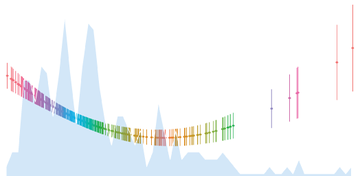

[//]: # CSS style arguments

<style type="text/css">

@import url('https://fonts.googleapis.com/css?family=Open+Sans+Condensed:300,300i,700');

h1, h2, h3, h4, h5, body {
font-family: 'Open Sans Condensed', sans-serif;
}

body{ 
      font-size: 16pt;
      counter-reset:table figure;
  }

.table{
  width:auto;
  font-size:26px;
}

th, td {
    padding-right: 30px;
}

caption::before{
  counter-increment: table;
  content: "Table " counter(table) ": ";
}

.caption::before{
  counter-increment: figure;
  content: "Figure " counter(figure) ": ";
}

caption, .caption{
  font-style:italic;
  font-size: 16px;
  margin-top:0.5em;
  margin-bottom:0.5em;
  width:80%;
  text-align: left;
}

#TOC {
  font-size: 17px;
  width: 100%;
}


</style>

```{r knitOpts, include=F}
knitr::opts_chunk$set(fig.width=12, fig.height=8, 
                      warning=FALSE, message=FALSE, eval=TRUE,
                      cache=TRUE, results = 'show',echo=TRUE)

```

```{r prolog, results='hide'}


'# PROLOG   #################################################'   

'# PROJECT: REGRESSION IN R EXERCISES #'   
'# PURPOSE: MULTIVARIATE REGRESSION W/ INTERACTION #'   
'# DIR:     Dropbox/R/RegressionInR #'   
'# DATA:    R11705472_SL320.csv #'   
'# AUTHOR:  Todd COMBS #'   
'# CREATED: MAY 18, 2018 #'   
'# LATEST:  JUL 27, 2018 #'   
'# NOTES:   Multivariate regression of child poverty in MSAs #'   
'#          Data from ACS 5-yr 2012-16 Social Explorer #'
'# PROLOG   ################################################'  

```



<br>
<br>
<br>
<br>


## Todd Combs

`r format(Sys.time(), '%d %B, %Y')`

<br>
<br>
<br>
<br>

# Child poverty in US Metropolitan Statistical Areas

## Introduction

<font size="5">
You work for a non-profit that is partnering with the government to combat child poverty in urban areas. You are tasked with identifying metropolitan statistical areas (MSAs) that are most at risk for high rates of child poverty. You decide to perform an OLS regression to determine the characteristics of large urban areas that are most correlated with child poverty. 

You have a dataset containing a sample of 300 MSAs. Read the data into R from this url: https://raw.githubusercontent.com/tbcombs/RnR/master/MSA2016.csv. You will also find variable definitions online here: https://raw.githubusercontent.com/tbcombs/RnR/master/MSA2016_dataDefs.txt.

You hypothesize that unemployment, income, and inequality are driving factors of child poverty, or that at least that each is  highly correlated with child poverty. You also want to test for a relationship between child poverty and racial diversity in MSAs, and to control for average household size, since as household size increases, it is logical to believe that there are more children. 
Finally, you suspect that large MSAs - those with one million or more people, are qualitatively different from smaller metro areas, and in addition, you believe that large MSAs that are relatively wealthy might be more likely to have social safety net programs in place and therefore lower rates of child poverty. You will model this relationship by including an interaction term in the model between income and the dichotomous variable for large MSAs.

## Step 1: Read in data & formulate hypotheses

Read in the data, review the data definitions, and formally state your hypothesis.

Read the data into R. Load only the libraries that you need.


```{r libsData}

#libraries
library(tidyverse)
library(magrittr)
library(lmtest)
library(stargazer)
library(car)
library(sandwich)


#data
r <- read_csv("https://raw.githubusercontent.com/tbcombs/RnR/master/MSA2016.csv")


```

## Step 2: Visualization of variables and relationships.

Create appropriate plots to 1) visualize the distribution of the dependent variable, 2) visualize each of the independent variables with the dependent variable, and 3) visualize the interaction between MSA size and income and its relationship with child poverty. Interpret the plots. Are the distributions approximately normal? What is the relationship? Is it linear? What else can you say about each plot?


```{r vizVars, fig.cap="Child poverty rates in 300 MSAs, 2016"}

g <- r %>%
  ggplot(aes(x=chPov_pc))

g <- g + geom_histogram(binwidth = 1) + theme_minimal() 

g <- g + labs(y="Chidren living at or below the poverty level, % by MSA 2016")

g


```
<br>
The dependent variable, child poverty, seems to be slightly skewed right from a few unusually high observations. Otherwise, the distribution seems approximately normal.

```{r vizRelation, fig.cap="Correlations of child poverty and predictor variables in MSAs, 2016"}


r2 <- r %>%
  select(2:4,7:8) %>%
  gather(key,val,-chPov_pc) %>%
  mutate(key = case_when(key=="hhsz"~"Average household size",
                         key=="gini"~"Gini index of inequality",
                         key=="rd"~"Racial diversity index",
                         key=="unemp_pc"~"Unemployment rate")) %>%
  rename(`Child poverty rate`=chPov_pc)

#visualize relationship
g <- r2 %>%
  ggplot(aes(x=val,y=`Child poverty rate`))

g <- g + geom_point() + geom_smooth(method="lm") + 
  facet_wrap(~key, scales='free_x') + theme_minimal()

g

```
<br>
The relationships here all seem positive to varying degrees. The strongest correlation looks to be between unemployment and child poverty rates in MSAs.

```{r vizRelation2, fig.cap="Correlations of child poverty and income in large and smaller MSAs, 2016"}


r2 <- r %>%
  select(2,5,6) %>%
  mutate(big = case_when(big==0~"Fewer than 1 million",
                         big==1~"1 million or more")) %>%
  rename(`Child poverty rate`=chPov_pc,
         `Median household income ($10,000s)`=mhhi10k,
         `MSA size`=big)

#visualize relationship
g <- r2 %>%
  ggplot(aes(x= `Median household income ($10,000s)`,
             y=`Child poverty rate`, color = `MSA size`,
             fill = `MSA size`))

g <- g + geom_point() + geom_smooth(method="lm")  +
  theme_minimal() + theme(legend.position = 'top')

g

```
<br>
Figure 3 shows the interaction of income and MSA size and child poverty. The relationship between income and child poverty is negative as expected. In smaller MSAs - those with fewer than one million people - the relationship is more negative, as seen in the slightly greater slope in the line of best fit.


## Step 3: Multivariate OLS model

Model child poverty (Y) on the predictors, including the interaction. Do not forget to include the categorical variable as a factor. Discuss the GOF for the model. How is the fit?

```{r mod1}
# recode msa size

r <- r %>%
  mutate(big = case_when(big==0~"Fewer than 1 million",
                         big==1~"1 million or more"))

r <- r %>% 
  mutate(big = factor(big)) %>%
  mutate(big = relevel(big, "Fewer than 1 million"))
#model 

summary(m1 <- lm(chPov_pc~ hhsz+ gini+rd+unemp_pc+mhhi10k*big,r))

```

Overall, the model fit is good. The adjusted R-squared is 0.79, and the statistically significant F-statistic lets us know that the model is better than the null model. 

## Step 5: Model diagnostics

Check the model for multicollinearity. Remember that the interaction term directly builds in multicollinearity, since two variables are represented twice. Are there other concerns about multicollinearity?

```{r MC, fig.cap="VIF values from regression model"}

mv <- vif(m1)
names(mv) <- c("Household size",
               "Gini inequality index",
               "Racial diversity index",
               "Unemployment rate",
               "Median household income",
               "MSA size",
               "MSA size * income")

mv2 <- as_tibble(mv) %>%
  mutate(vars = names(mv))

g <- mv2 %>%
  ggplot(aes(x=value, y=reorder(vars,value),
             color=vars))

g <- g + geom_point(size=5)

g <- g + theme_minimal() + theme(legend.position = 'none')
g <- g + labs(y="",x="VIF")
g

```
<br>
The VIF values for the terms in the interaction are really high, as expected, but the others are small, all below 2.

Check the model for heteroskedasticity visually and with a test statistic. Interpret the plot. Should you reject or fail to reject the null hypothesis of the Breush Pagan test? 

```{r diags1, fig.cap="Residuals vs. fitted plot"}

# check for heteroskedasticity
bptest(m1)

# get residuals and fitted values with SEs
r <- r %>%
  mutate(res = as.numeric(resid(m1)),
         fit = as.numeric(predict(m1)),
         seFit = as.numeric(predict(m1,se=T)[[2]]))

# residuals vs fitted plot
rvf <- r %>%
  ggplot(aes(x=fit,y=res))

rvf <- rvf + geom_point() +
  geom_hline(yintercept = 0,color="red",linetype=2)

rvf <- rvf + labs(x="Fitted values",
                  y="Residuals", 
                  subtitle="p-value from Breusch-Pagan test: 1.276e-08") + theme_minimal()
rvf
```
<br>
The Breusch-Pagan test rejects the assumption of homoskedasticity, so robust standard errors are needed. The residuals-versus-fitted plot shows more variance as the predicted values get larger, meaning that the model is better at explaining child poverty when child poverty is low.


Check that the continous predictors are linear with the model predictions through visualization. Do the relationships seem sufficiently linear?

```{r diags2, fig.cap="Check for linearity of predictions"}
# check for linearity

r2 <- r %>%
  select(3:5,7:8,10) %>%
  gather(key,val,-fit) %>%
  mutate(key = case_when(key=="hhsz"~"Average household size",
                         key=="gini"~"Gini index of inequality",
                         key=="rd"~"Racial diversity index",
                         key=="unemp_pc"~"Unemployment rate",
                         key=="mhhi10k"~"Median household income ($10,000s)")) 
 
  
lc <- r2 %>%
  ggplot(aes(x=val,y=fit))

lc <- lc + geom_point() + geom_smooth(method="lm")
lc <- lc + facet_wrap(~key, scales="free_x")
lc <- lc + labs(y="Fitted values", x="") + theme_minimal()

lc

```
<br>
The relationships here in Figure 6 all seem adequately linear.

<br>
Check for influential observations. If necessary, re-run the model without potential offending observations and compare coefficient estimates. Should you keep the whole sample or discard some influential observations? 

```{r ios, fig.cap="Cook's d values"}
g <- ggplot(m1, aes(seq_along(.cooksd), .cooksd))
r2 <- as_tibble(g$data)
r <- r %>%
  mutate(cooksd = r2 %$% .cooksd)

r <- r %>%
  mutate(high = case_when(cooksd>mean(cooksd)*3~"Over 3*mean(cooks'd)",
                         cooksd<=mean(cooksd)*3~"Acceptable        "),
         obs = row_number()) 

g <- r %>%
  ggplot(aes(x=obs, y=cooksd, color=high))

g <- g + geom_point()
                    
                    
g <- g+labs(x="Obs. Number", y="Cook's distance", color="",title="Cook's distance")

g <- g  + theme_minimal() + theme(legend.position = 'top')

g


```
<br>
The cook's d values suggest that some MSAs might be unusual and too influential. 

```{r mod2}

summary(m2 <- lm(chPov_pc~ hhsz+ gini+rd+unemp_pc+mhhi10k*big,
                 r %>% filter(cooksd<0.1)))

```
<br>
After re-running the model without observations that had cook's d values greater than 0.1, many of the coefficients changed by non-ignorable amounts. This should be the final model (without the five observations).

## Step 6: Model results

Present the model results in a table or graph and confirm whether you have retained the entire sample. Interpret everything you should interpret. Should you accept your alternative hypotheses or reject them?

```{r modResults, results='asis'}
# get robust errors
m3 <- coeftest(m2, vcov=vcovHC(m2))

#table results
stargazer(m3, type = 'html',
          covariate.labels = c("Household size", "Gini index", "Racial diversity", "Unemployment rate", "Median income ($10k)", "MSA size: 1m+","Income*size"),
          dep.var.labels   = "Child poverty rate",
          title="Model results", style="ajps", ci=T,
          add.lines = list(c("Observations","295"),
                           c("Adjusted R-sq.","0.79")),
          single.row = T, column.sep.width = "25")

```
<br>
<br>
Our model explains about 80% of the variance in child poverty rates in MSAs. Household size, economic inequality, racial diversity, and MSA size are all positively correlated with child poverty, while income is negatively correlated. 


## Step 7: Visualize predictions

Create some graphs to visualize the predicted rates of child poverty across representative values (or the ranges) of the predictors. Create at least one graph depicting how the interaction affects predictions. Also, two coefficients are directly comparable. Which are they, and how do they compare substantively?

```{r preds1, fig.cap="Economic inequality & racial diversity: predicted values of child poverty in MSAs"}

#FUNCTION FOR HETEROSKEDASTICITY CONSISTENT PREDICTIONS
# mod = model name; newdata = new data frame for predictions
predict.HCC <- function(mod,newdata){
  require(tidyverse)
  require(lmtest)
  require(AER)
  if(missing(newdata)){ newdata <- mod$model }
  m.mat <- model.matrix(mod$terms,data=newdata)
  fit <- as.vector(m.mat %*% mod$coef)
  newvcov <- vcovHC(mod)
  se.fit <- sqrt(diag(m.mat %*% newvcov %*% t(m.mat)))
  return(tibble(fit=fit,se=se.fit))
}

#create new datasets to explore predictions for the two indexes.
r2 <- as_tibble(m2$model)

gg <- r2 %>%
  mutate_at(vars(hhsz, rd, unemp_pc, mhhi10k),
            .funs = function(x) x=mean(x)) %>%
  mutate(gini = seq(quantile(gini,0.1),
                    quantile(gini, 0.9),
                    length.out = nrow(r2))) %>%
  mutate(big = c(rep(c("Fewer than 1 million",
                     "1 million or more"),nrow(r2)/2),
                 "Fewer than 1 million"))

rr <- r2 %>%
  mutate_at(vars(hhsz, gini, unemp_pc, mhhi10k),
            .funs = function(x) x=mean(x)) %>%
  mutate(rd = seq(quantile(rd,0.1),
                    quantile(rd, 0.9),
                    length.out = nrow(r2))) %>%
  mutate(big = c(rep(c("Fewer than 1 million",
                     "1 million or more"),nrow(r2)/2),
                 "Fewer than 1 million"))
# get predictions
gp <- predict.HCC(m2,gg)
rp <- predict.HCC(m2,rr)

# add values for gini + rd
gp <- gp %>% mutate(var=gg %$% gini, lab="Gini index") %>%
  mutate(big = c(rep(c("Fewer than 1 million",
                     "1 million or more"),nrow(r2)/2),
                 "Fewer than 1 million"))
rp <- rp %>% mutate(var=rr %$% rd, lab="Racial diversity index") %>%
  mutate(big = c(rep(c("Fewer than 1 million",
                     "1 million or more"),nrow(r2)/2),
                 "Fewer than 1 million"))
gr <- bind_rows(gp,rp)

# get CIs
gr <- gr %>%
  mutate(lb=fit-1.96*se,
         ub=fit+1.96*se)

#plot

g <- gr %>%
  ggplot(aes(x=var,y=fit,ymin=lb,ymax=ub,color=big,fill=big))
g <- g + geom_ribbon(alpha=0.4) + geom_line()
g <- g + facet_wrap(~lab) + theme_minimal() +
  labs(fill="",color="", x="",y="Predicted child poverty rate (%)")
g


```
<br>

Economic inequality (Gini) and the racial diversity index both are ratios between 0 and 1 and therefore their effects can be directly compared. Figure 8 shows the predicted values of child poverty in the average MSA. For each plot, all other variables were held at their mean, and only the variable in question was allowed to vary. Each ranges from its 10th to 90th percentile. We see that the slope for the Gini index is much steeper than that of the racial diversity index when the x-axis is forced to be the same in both plots. This illustrates the MUCH larger effect of economic inequality on child poverty than that of racial diversity. Indeed, the coefficient for the Gini index is more than five times that of racial diversity. In each of these plots, we see parallel lines for large or smaller MSAs, which is expected, since the interaction term was for income, not for either of these variables.


```{r preds2, fig.cap="Unemployment & household size: predicted values of child poverty in MSAs"}


#create new datasets to explore predictions for the two vars.
r2 <- as_tibble(m2$model)

hh <- r2 %>%
  mutate_at(vars(gini, rd, unemp_pc, mhhi10k),
            .funs = function(x) x=mean(x)) %>%
  mutate(hhsz = seq(quantile(hhsz,0.1),
                    quantile(hhsz, 0.9),
                    length.out = nrow(r2))) %>%
  mutate(big = c(rep(c("Fewer than 1 million",
                     "1 million or more"),nrow(r2)/2),
                 "Fewer than 1 million"))

uu <- r2 %>%
  mutate_at(vars(hhsz, gini, rd, mhhi10k),
            .funs = function(x) x=mean(x)) %>%
  mutate(unemp_pc = seq(quantile(unemp_pc,0.1),
                    quantile(unemp_pc, 0.9),
                    length.out = nrow(r2))) %>%
  mutate(big = c(rep(c("Fewer than 1 million",
                     "1 million or more"),nrow(r2)/2),
                 "Fewer than 1 million"))
# get predictions
hp <- predict.HCC(m2,hh)
up <- predict.HCC(m2,uu)

# add values for unemp + hhsz
hp <- hp %>% mutate(var=hh %$% hhsz, lab="Household size") %>%
  mutate(big = c(rep(c("Fewer than 1 million",
                     "1 million or more"),nrow(r2)/2),
                 "Fewer than 1 million"))
up <- up %>% mutate(var=uu %$% unemp_pc, lab="Unemployment rate") %>%
  mutate(big = c(rep(c("Fewer than 1 million",
                     "1 million or more"),nrow(r2)/2),
                 "Fewer than 1 million"))
gr <- bind_rows(hp,up)

# get CIs
gr <- gr %>%
  mutate(lb=fit-1.96*se,
         ub=fit+1.96*se)

#plot

g <- gr %>%
  ggplot(aes(x=var,y=fit,ymin=lb,ymax=ub,color=big,fill=big))
g <- g + geom_ribbon(alpha=0.4) + geom_line()
g <- g + facet_wrap(~lab, scales = "free_x") + theme_minimal() +
  labs(fill="",color="", x="",y="Predicted child poverty rate (%)")
g


```
<br>
Both household size and unemployment are positively related to child poverty, as expected (Figure 9). In large MSAs, we see that a 0.4 increase in the average household size predicts about a 2% increase in child poverty, all else equal. For unemployment, a difference of 4% (from 6 to 10% unemployment) predicts a difference of about 3%, all else equal.


```{r preds3, fig.cap="Income & MSA size: predicted values of child poverty in MSAs"}


#create new dataset to explore predictions for the interaction.
r2 <- as_tibble(m2$model)

inc <- r2 %>%
  mutate_at(vars(gini, rd, unemp_pc, hhsz),
            .funs = function(x) x=mean(x)) %>%
  mutate(mhhi10k = seq(quantile(mhhi10k,0.1),
                    quantile(mhhi10k, 0.9),
                    length.out = nrow(r2))) %>%
  mutate(big = c(rep(c("Fewer than 1 million",
                     "1 million or more"),nrow(r2)/2),
                 "Fewer than 1 million"))


# get predictions
ip <- predict.HCC(m2,inc)

# add values for income
ip <- ip %>% mutate(var=inc %$% mhhi10k, lab="Median HH income ($10,000s") %>%
  mutate(big = c(rep(c("Fewer than 1 million",
                     "1 million or more"),nrow(r2)/2),
                 "Fewer than 1 million"))


# get CIs
ip <- ip %>%
  mutate(lb=fit-1.96*se,
         ub=fit+1.96*se)

#plot

g <- ip %>%
  ggplot(aes(x=var,y=fit,ymin=lb,ymax=ub,color=big,fill=big))
g <- g + geom_ribbon(alpha=0.4) + geom_line()
g <- g  + theme_minimal() +
  labs(fill="",color="", x="Median HH income in $10,000s",
       y="Predicted child poverty rate (%)")
g


```

<br>
Figure 10 shows the interaction of income and MSA size and the predicted values of child poverty. Though the confidence intervals overlap, we see a slightly larger negative slope in large MSAs, resulting in higher predictions versus smaller MSAs when incomes are lower, but lower predictions versus smaller MSAs when incomes are larger ($60k and above). We also see that the size of the MSA matters least when incomes are average (around the middle of the plot, or ~\$52k). The predictions here for both sizes of MSA are closest and most overlapping.

## Step 8: Discussion

What are your recommendations for choosing MSAs in which to implement the anti-child poverty program? Which characteristics do you think are most important?

Recommendations should include looking at income, unemployment and economic inequality as important correlates of child poverty, also - to a lesser extent - providers should consider racial diversity when choosing program locations.